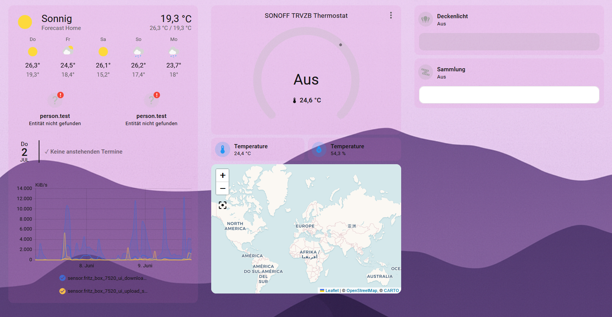

# Lavistaris

Ein dunkel-lila / mystisches Theme für Home Assistant mit Light- und Dark-Mode, eigenem Hintergrundbild und [card_mod](https://github.com/thomasloven/lovelace-card-mod) Unterstützung für transparente Karten.


## Vorschau

<table>
  <tr>
    <th>Light</th>
    <th>Dark</th>
  </tr>
  <tr>
    <td></td>
    <td></td>
  </tr>
</table>


## Voraussetzungen

- [HACS](https://hacs.xyz/) installiert
- Das Frontend-Modul [card_mod](https://github.com/thomasloven/lovelace-card-mod) installiert und als Ressource eingebunden (für die transparenten Karten-Hintergründe)
- Zwei Hintergrundbilder unter `/config/www/`:
  - `Lavistaris_light.png`
  - `Lavistaris_dark.png`

  (werden dann über `/local/...` referenziert)

## Installation

### Manuell

1. Ordner `themes/Lavistaris.yaml` nach `/config/themes/Lavistaris.yaml` kopieren
2. In der `configuration.yaml` sicherstellen, dass Themes aktiviert sind:
   ```yaml
   frontend:
     themes: !include_dir_merge_named themes
   ```
3. Home Assistant neu starten
4. Theme unter **Einstellungen → Personalisierung** auswählen

## Enthaltene Variablen

Das Theme setzt u. a. `primary-color`, `accent-color`, `sidebar-*`, `app-header-*` sowie ein eigenes `lovelace-background` pro Modus. Über `card-mod-card` wird zusätzlich der Hintergrund jeder `ha-card` leicht transparent eingefärbt.

## Lizenz
